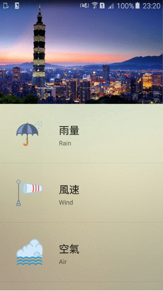
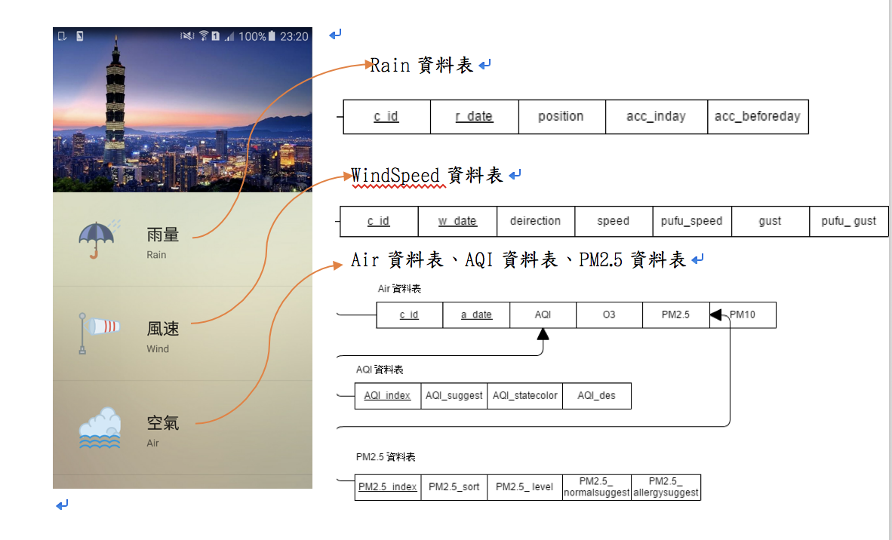

# SQLite資料庫實作

###  使用Android 搭配SQLite實作天氣資料新增修改刪除功能

 

> 此App是以Android Studio平台開發使用Java語言攥寫，Java比其他程式設計語言容易撰寫、編譯、除錯及學習，除此之外Java是物件導向的，可以建立模組化程式和可重覆使用的程式碼，而且支援的平台多，較方便移植至其他裝置，它的開放資源眾多、套件眾多，也容易開發。
App內的Database是以Android內建的SQLite實作，首先建立6個表格分別是Country、Rain、Wind、Air、AQI、PM2.5，其中AQI以及PM2.5外來鍵參考到Air資料表，兩個外來鍵資料表分別記錄著詳細資料以供App展開顯示更多資訊使用。
每個主建都具有唯一性，所以每當資料新增時會判斷該筆資料是否為重複值，若是的話則提醒該使用者有重複的資料，另外設計界面的時候利用下拉式選單選擇縣市以及利用日曆的方式供使用者選擇日期較為人性化。
